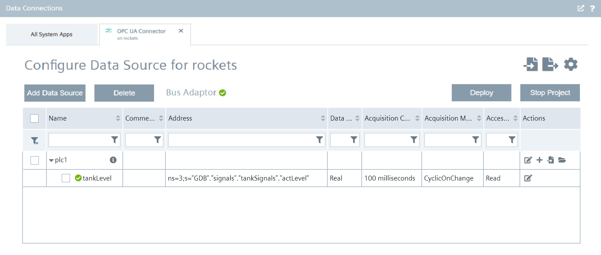

# Installation

- [Installation](#installation)
  - [Setting up the Databus](#setting-up-the-databus)
  - [Setting up the OPC UA Connector](#setting-up-the-opc-ua-connector)
  - [Setting up the Connection to the cloud](#setting-up-the-connection-to-the-cloud)
    - [Creating a new policy for the aws IoT device](#creating-a-new-policy-for-the-aws-iot-device)
    - [Creating a aws IoT Thing](#creating-a-aws-iot-thing)
    - [Setting up the IE Cloud Connector](#setting-up-the-ie-cloud-connector)
    - [Testing the Connection to the cloud](#testing-the-connection-to-the-cloud)

## Setting up the Databus

In this example, two topics on the IE Databus are used.

The fist one is used by the OPC UA Connector to publish the data read from the PLC:
For example: `ie/d/j/simatic/v1/opcuac1/dp/r/plc1/tankLevel`

The second is used by the IE Cloud Connector to receive data which will then be published to the cloud.
For example: `CloudConnector/toAWS`

To set up a user with publish and subscribe permission, open the IE Databus Configurator for your device and set it up accordingly. In this example, a user `edge` has permission to publish and subscribe to `ie/#` and `CloudConnector/#`

## Setting up the OPC UA Connector

- Open the OPC UA Connector Configurator
- Enter the Databus User and Password in the Settings. "Bulk Publish" must be deactivated.
- Add your PLC as a data source
- Browse the tags and select  `GDB_externalSignals_tankSignals_actLevel` with a 100ms acquisition cycle.

## Setting up the Connection to the cloud

Before starting the IE Cloud Connector Configurator, a new policy and a new device have to be set up in the aws IoT management console.

### Creating a new policy for the aws IoT device

In the aws IoT management console:

- navigate to "Secure" -> "Policies"
- Click on "Create a Policy"
- enter a name for the policy
- in the "Action" text box, enter: `iot:Publish, iot:Connect`
- in the "Resource ARN" enter the character "*"
- Check the "Allow" box under "Effect"
- Click "create"

The policy has been created successfully

### Creating a aws IoT Thing

In the aws IoT management console:

- navigate to "Manage" -> "Things"
- Click on "register a new thing"
- CLick in "create a single thing"
- Enter a name and click "Next"
- Click "Create certificate", wait for the certificates to be created and download all to your local machine
- Click in "Activate"
- Click on "Attach a policy" and select the policy you created in the previous step
- Click on "Register Thing"

The thing has been registered successfully

### Setting up the IE Cloud Connector

Now that a IoT device is created in the aws cloud, the IE Cloud Connector can be set up.

Launch the IE Cloud Connector Configurator for your IE Device.

- Click on "Edit Configuration"
- Enter a Client ID e.g. `CCclient`, HostName: `ie-databus`, Port Number: `1883`
- The Subscription Topic is the topic to which the Cloud Connector will subscribe to listen for data to publish to the cloud. E.g. `CloudConnector/#` . This means the Cloud Connector can subscribe to all topics starting with `CloudConnector/`
- enter the Username and Password of the user you created during the databus setup

The Bus Adaptor Configuration is now complete

- Click "Add Topic" and enter a topic name, e.g `CloudConnector/toAWS` and click save. This topic must start with the name configured in the previous step.
- Click on Add Route
- enter a name for the route

The last part is to configure the cloud connector client

- Click on "Add Client"
- Enter a Name e.g `awsClient` and choose `AWS` as type and click "save"
- select the certificate and private key you downloaded when creating the aws thing
- click on the edit symbol net to the client
- enter a Client ID e.g `ccID`. This will be the ID used by the connector to publish data to the MQTT broker of the aws IoT device.
- enter the hostname of the aws endpoint. You can find the address at the "Settings" section of the aws IoT console. It looks similar to this: `abcdefghi12345.iot.us-east.amazonaws.com`
- enter `8883` as Port Number
- enter Proxy settings if needed
- Now select the route, check the box next to the bus adaptor topic `CloudConnector/toAWS` and check the box next to Cloud Connector Clients `awsClient`
- click "save"

Now every data published to the bus adaptor topic of the IE Databus will get published to the aws cloud.
E.g. data published to the topic `CloudConnectot/toAWS` in the IE Databus will get published to the topic `CloudConnector/` of the aws IoT thing. The publish topic to which the IE Cloud Connector will publish the data in the aws cloud is set in the "Advanced" Tab of the IE Cloud Connector Client settings, the default value is `CloudConnector/`

### Testing the Connection to the cloud

In the AWS IoT management console:

- Navigate to "Manage" -> "Things" and select the thing you created
- Click on "Activity" and "MQTT Client"
- in "Subscribe to topic" enter the topic the Cloud Connector is publishing to. E.g. `CloudConnector/`
- open the IE Flow Creator an publish some test data to the topic the Cloud Connector is subscribing to. E.g. `CloudConnector/toAWS`
- The data will be visible in the IoT management console

